# Awesome-Vision-Transformer

## 👁️ Vision Transformers (ViTs): Evolution, Variants, Types, & Applications 🚀

The Vision Transformer (ViT) represents a monumental paradigm shift in computer vision, dismantling decades of dominance held by Convolutional Neural Networks (CNNs). Introduced by Dosovitskiy et al. in 2020 ("An Image is Worth 16x16 Words"), ViTs reshape computer vision by treating image processing exactly like a natural language processing task. By slicing an image into a structured grid of flattening patches and treating each patch as a "word token," ViTs harness parallel Multi-Head Self-Attention (MHA) mechanics. This entirely removes convolutional inductive biases, allowing the network to capture global contextual relationships from layer zero, unlocking exceptional power-law scaling properties for foundation AI models.

---

## 🚀 1. The Chronological Evolution

The technical progression of transformer-based vision has transitioned from rigid, compute-heavy token matrices to multi-scale spatial hierarchies, moving toward unified cross-modal foundation tokenization engines.

| Era / Stage | Year | Paper Link | Concept & Significance / Limitation |
| :--- | :--- | :--- | :--- |
| [**The Vanilla Global Attention Era (Dosovitskiy et al., 2020)**](details/vanilla_vit_era.md) | 2020 | [Dosovitskiy et al., 2020](https://arxiv.org/abs/2010.11929) | **Concept:** The defining architectural breakthrough. Images were split into uniform $16\times16$ pixel patches, projected linearly into embedding spaces, appended with learned positional coordinates, and passed to a standard text-style Transformer encoder.  **Limitation:** Suffered from a catastrophic **Quadratic Computational Wall ($O(N^2)$)** relative to image resolution. Because every patch had to attend to every other patch globally, processing high-resolution graphics or video clips choked hardware configurations. It also lacked inductive biases, requiring massive pre-training sets (like JFT-300M) to converge. |
| [**The Hierarchical Sliding Window Era (Swin Transformer, Liu et al., 2021)**](details/swin_transformer_era.md) | 2021 | [Liu et al., 2021](https://arxiv.org/abs/2103.14030) | **Concept:** Resolved the quadratic scaling crisis by introducing local spatial constraints. The **Swin (Shifted Windows) Transformer** computed self-attention strictly within localized patch blocks, shifting the window configuration across successive layers to allow cross-window information travel.  **Significance:** Successfully dropped computational complexity down to **Linear Scaling ($O(N)$)** relative to image size. It re-introduced multi-scale hierarchical feature maps (mimicking CNN pyramid levels), making transformers competitive for dense pixel tasks like object detection and segmentation. |
| [**The Unified Multi-Modal Token Era (~2024–Present)**](details/unified_multimodal_token_era.md) | 2024 | [Chameleon Team, 2024](https://arxiv.org/abs/2405.09818) | **Concept:** The modern state-of-the-art foundation standard. Vision Transformers shifted from standalone encoders to integrated frontend tokenizers. Architectures like **ViT-VQGAN** serialize image frames straight into discrete or continuous token strings.  **Significance:** Unifies sight and language under a single execution graph. Image patches and text characters enter the exact same autoregressive workspace natively, co-adapting features simultaneously during large-scale pre-training cycles. |

---

## 🧠 2. Core Functional & Attention Variants

The Vision Transformer family tree features specialized architectural modifications designed to optimize patch processing speed and manage token density bounds.

| Variant | Year | Paper Link | Mechanism & Characteristics |
| :--- | :--- | :--- | :--- |
| [**Global Vision Transformers (Vanilla ViT)**](details/global_vision_transformers.md) | 2020 | [Dosovitskiy et al., 2020](https://arxiv.org/abs/2010.11929) | **Mechanism:** Every single patch token calculates a dot-product attention score with all other tokens across the full canvas length. It delivers absolute global context tracking but is strictly bounded to low-resolution configurations (e.g., $224\times224$ pixels). |
| [**Hierarchical Window Transformers (Swin Class)**](details/hierarchical_window_transformers.md) | 2021 | [Liu et al., 2021](https://arxiv.org/abs/2103.14030) | **Mechanism:** Enforces a local bounding mesh. Attention calculations are confined to small, non-overlapping spatial cells, shifting coordinates diagonally in the next layer to bridge informational boundaries. |
| [**Deformable DETR / Sparse Transformers**](details/deformable_detr_sparse_transformers.md) | 2020 | [Zhu et al., 2020](https://arxiv.org/abs/2010.04159) | **Mechanism:** Instead of attending to all patches uniformly, each query token adaptively samples only a small, dynamically discovered cluster of highly key points across the spatial matrix.  **Pros:** Exceptionally precise for localization and structural grounding tasks, optimizing object detection pipelines. |
| [**Multi-Head Latent Attention (MLA Vision Extensions)**](details/multi_head_latent_attention_mla.md) | 2024 | [DeepSeek-V2, 2024](https://arxiv.org/abs/2405.04434) / [MHA2MLA-VLM, 2026](https://arxiv.org/abs/2601.11464) | **Mechanism:** Compresses the massive Key-Value (KV) cache generated by visual patch sequences down into a compact, low-rank latent vector before multi-head projection occurs. |

---

## 🏋️ 3. Training Dynamics & Pretext Modalities

Because ViTs lack the localized spatial assumptions hardwired into convolutions, stabilizing their optimization requires specialized data-driven training schemes.

| Training Scheme / Modality | Year | Paper Link | Pipeline & Significance |
| :--- | :--- | :--- | :--- |
| [**Supervised ImageNet Scaling**](details/supervised_imagenet_scaling.md) | 2020 | [Dosovitskiy et al., 2020](https://arxiv.org/abs/2010.11929) / [Touvron et al., 2020](https://arxiv.org/abs/2012.12877) | **Pipeline:** The classical approach. Trains the network graph over millions of heavily annotated categorical labels, forcing the attention heads to manually learn translational invariance and edge tracking over long training epochs. |
| [**Masked Autoencoding (MAE / Self-Supervised Paradigm)**](details/masked_autoencoding_mae.md) | 2021 | [He et al., 2021](https://arxiv.org/abs/2111.06377) | **Pipeline:** Introduced by He et al. It randomly masks or deletes up to $75\%$ of an image's patch tokens during pre-training. The ViT encoder processes only the remaining $25\%$ visible patches, and a lightweight decoder is tasked with mathematically reconstructing the missing pixels.  **Significance:** The industry-standard default baseline for training vision foundation blocks, forcing the attention layers to develop a deep, high-level understanding of physical geometries and object boundaries without human labels. |
| [**Contrastive Alignment (CLIP Frontends)**](details/contrastive_alignment_clip.md) | 2021 | [Radford et al., 2021](https://arxiv.org/abs/2103.00020) | **Pipeline:** Couples a ViT encoder alongside a Text Transformer, optimizing a symmetric cross-entropy loss function to pull matching image-caption token arrays together while repelling unaligned strings. |

---

## 🛠️ 4. Production Engineering Challenges & Mitigations

Deploying Vision Transformers within high-throughput commercial enterprise environments introduces intense memory bottlenecks and token-count inflation penalties.

| Challenge | Year | Paper Link | The Problem & Mitigation |
| :--- | :--- | :--- | :--- |
| [**The Visual Token Explosion & KV Cache Satiation**](details/visual_token_explosion_kv_cache.md) | 2022 | [Bolya et al., 2022](https://arxiv.org/abs/2210.09461) / [LLaVA-NeXT, 2024](https://arxiv.org/abs/2401.12941) | **The Problem:** Processing high-resolution images or multi-page documents (e.g., blueprints) creates thousands of localized patches. This explodes the model's internal token history, completely saturating Key-Value cache VRAM and causing runtime serving latencies to spike.  **Mitigation:** Implementing **Dynamic Resolution Patching (AnyRes)**, which chunks massive megapixel frames into a collection of localized focus patches stitched alongside a global downsampled thumbnail, coupled with **Token Pooling/Pruning kernels** (like ToMe) to merge redundant background tokens dynamically. |
| [**The Low-Level Feature Blur Hazard**](details/low_level_feature_blur.md) | 2021 | [Xiao et al., 2021](https://arxiv.org/abs/2106.14881) | **The Problem:** Rigidly flattening an image into $16\times16$ blocks at step zero can discard microscopic details (like fine text lettering or delicate crack textures), causing the transformer layers to underfit fine-grained spatial boundaries.  **Mitigation:** Prepending a **Convolutional Stem Layer** (a few shallow CNN layers) right before the patch-projection phase to cleanly lock down low-level spatial gradients and edge details. |

---

## 🌐 5. Frontier Real-World AI Applications

| Application Field | Year | Paper Link | Description & Use Case |
| :--- | :--- | :--- | :--- |
| [**Enterprise Document, Chart, & GUI Auditing Agents**](details/document_chart_gui_agents.md) | 2021 | [Kim et al., 2021](https://arxiv.org/abs/2111.15664) | Processes multi-column financial PDFs, multi-axis chart grids, and structural engineering schematics. High-resolution ViT encoders parse complex layouts, allowing tool-augmented corporate agents to execute compliance checking and data extraction loops instantaneously. |
| [**Autonomous Vehicle Spatio-Temporal BEV Perception Stacks**](details/autonomous_vehicle_bev_perception.md) | 2022 | [Li et al., 2022](https://arxiv.org/abs/2203.17270) | Drives real-time navigation pipelines for self-driving vehicles and robotic fleets. Multiple camera streams are chunked into visual patch tokens, which are projected by a spatial transformer into a unified 3D Bird's-Eye-View (BEV) coordinate map to execute real-time path routing safely. |
| [**Generative Flow-Matching and Video Diffusion Simulators (Sora Class)**](details/generative_flow_matching_video_diffusion.md) | 2024 | [OpenAI, 2024](https://openai.com/research/video-generation-models-as-world-simulators) | Serves as the core structural backbone for state-of-the-art video generation engines. Video clips are sliced into 3D spacetime token cubes (patches extended across time). The Spatio-Temporal ViT processes these cubes concurrently, predicting straight-line ODE trajectories to synthesize physically consistent, fluid video sequences. |

