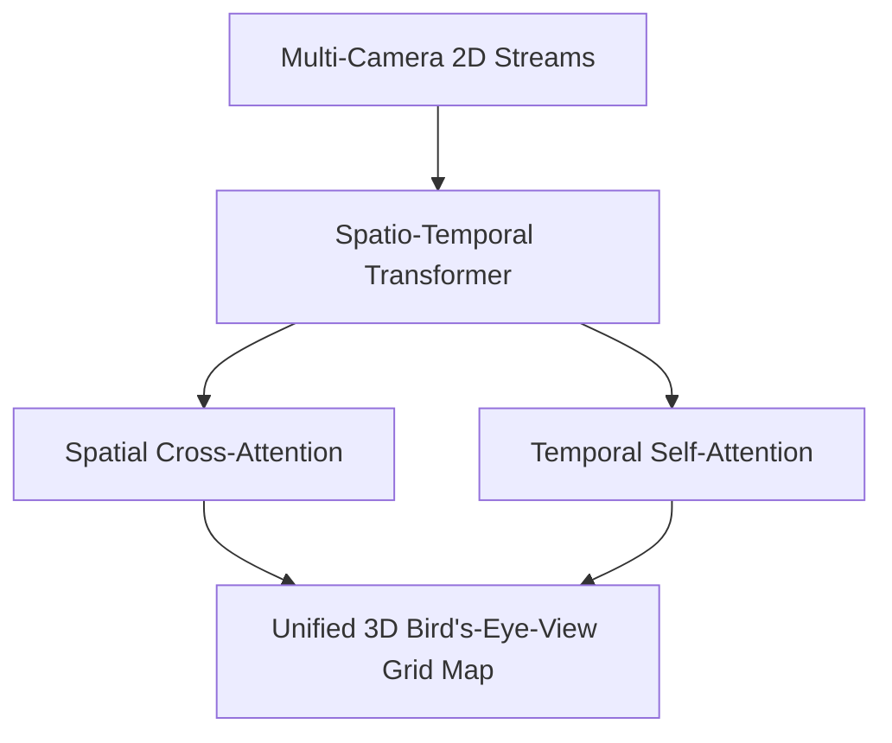

# Autonomous Vehicle Spatio-Temporal BEV Perception Stacks

Autonomous Vehicle Spatio-Temporal BEV Perception Stacks aggregate inputs from multiple multi-camera video streams into a unified 3D Bird's-Eye-View (BEV) map. The BEVFormer architecture uses grid-shaped BEV queries to perform spatial cross-attention across cameras and temporal self-attention across history frames. This provides stable object tracking, velocity estimation, and robust self-driving navigation maps.

## Architectural Diagram

---
[← Back to README](../README.md)
