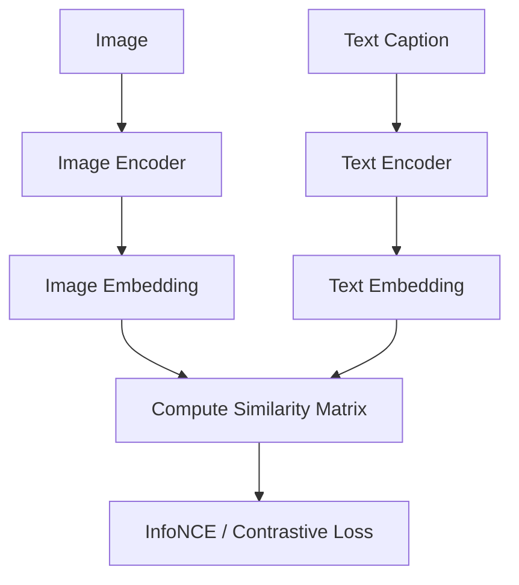

# Contrastive Alignment (CLIP)

Contrastive Alignment, typified by OpenAI's CLIP (Contrastive Language-Image Pre-training), trains joint vision-language encoders. An image encoder (usually a ViT) and a text encoder (usually a Transformer) embed paired visual and textual descriptions into a shared latent space. The training objective maximizes the cosine similarity of matching pairs while minimizing it for mismatched pairs, yielding highly generalizable zero-shot classifiers.

## Architectural Diagram

---
[← Back to README](../README.md)
