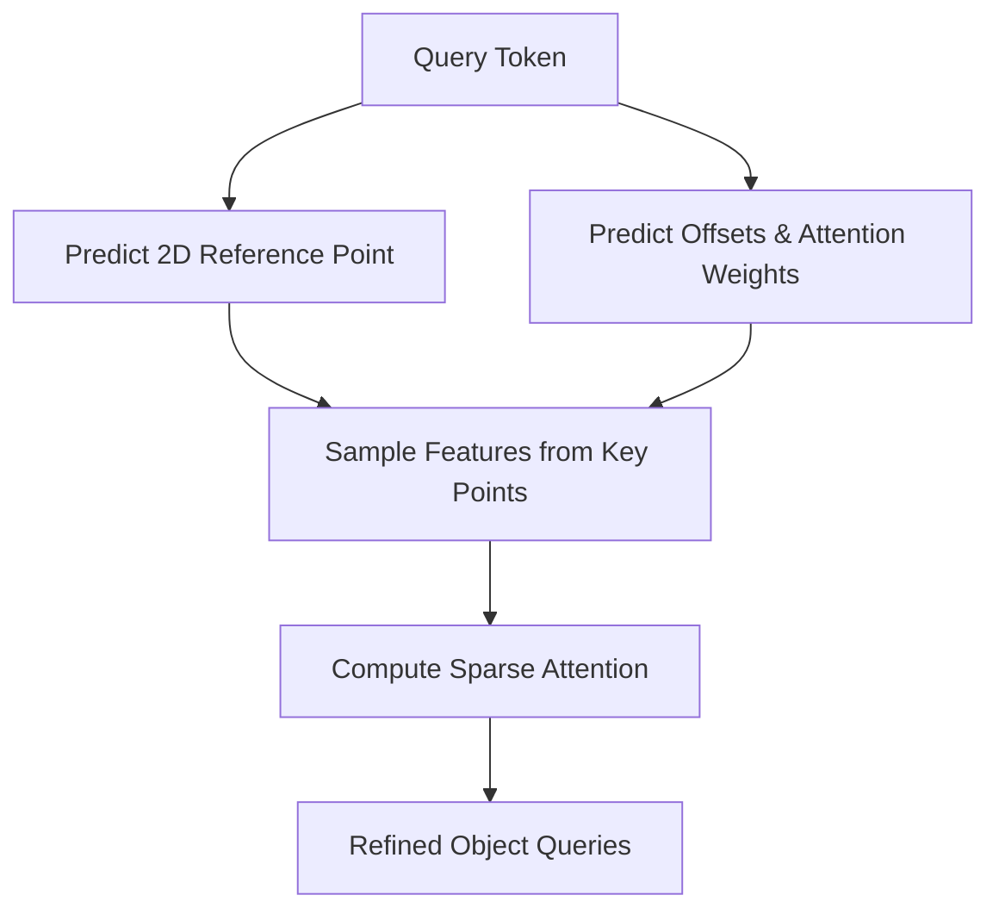

# Deformable DETR & Sparse Transformers

Deformable DETR and Sparse Transformers mitigate the computation of dense attention matrices by only attending to a small, dynamically determined subset of key positions. For each query token, a small set of reference points and offsets is predicted by the model, and features are sampled adaptively. This sparse mapping allows rapid convergence and precise spatial localization, making it particularly powerful for object detection architectures.

## Architectural Diagram

---
[← Back to README](../README.md)
