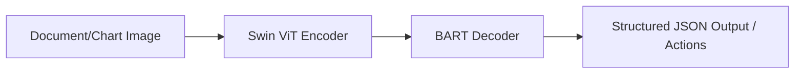

# Enterprise Document, Chart, & GUI Auditing Agents

Enterprise Document, Chart, & GUI Auditing Agents utilize high-resolution Vision Transformers to parse complex, structured layouts such as multi-column PDFs, financial balance sheets, GUI mockups, and engineering schematics. Models like Donut bypass traditional, error-prone OCR engines entirely by encoding document images directly into representations that decoders translate into structured text outputs or machine-executable actions.

## Architectural Diagram

---
[← Back to README](../README.md)
