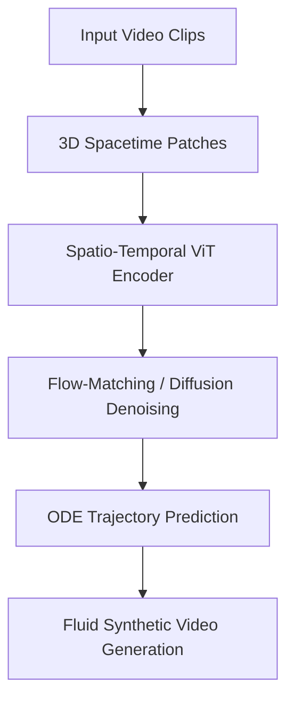

# Generative Flow-Matching & Video Diffusion Simulators

Generative Flow-Matching and Video Diffusion Simulators represent the state-of-the-art in high-fidelity video generation. Systems like OpenAI's Sora treat video frames as 3D spacetime patch cubes. The Spatio-Temporal ViT models these cubes globally over time, training conditional diffusion models via flow-matching. The networks learn to predict ODE paths that denoise latent vectors into physically coherent, fluid video sequences.

## Architectural Diagram

---
[← Back to README](../README.md)
