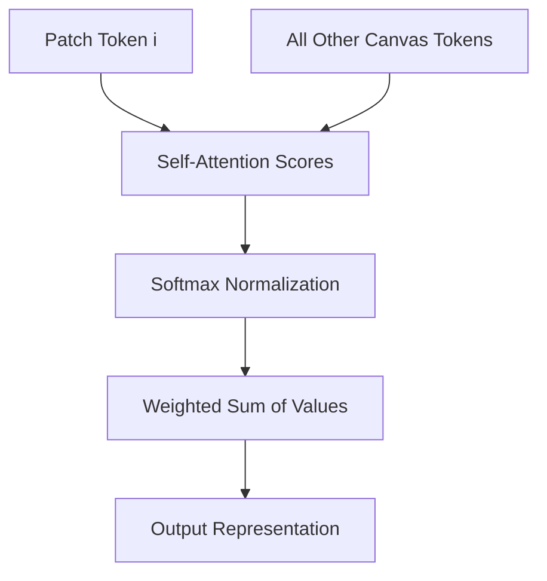

# Global Vision Transformers

Global Vision Transformers utilize vanilla self-attention where each patch token is compared to every other patch token globally. This maximizes the receptive field, allowing the network to capture global contextual relations starting from the very first layer. However, the calculation of the attention matrix requires $O(N^2)$ computations, making it unsuitable for processing high-resolution images natively without massive downsampling or hardware acceleration.

## Architectural Diagram

---
[← Back to README](../README.md)
