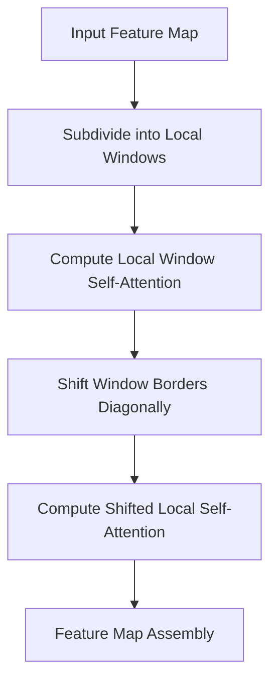

# Hierarchical Window Transformers

Hierarchical Window Transformers constrain self-attention within localized pixel boundaries (or windows). Layers alternate between standard window-based multi-head self-attention (W-MSA) and shifted window-based multi-head self-attention (SW-MSA). This design drastically reduces the visual token matching search space while maintaining efficient information exchange across window boundaries, making it ideal for downstream tasks like object detection and semantic segmentation.

## Architectural Diagram

---
[← Back to README](../README.md)
