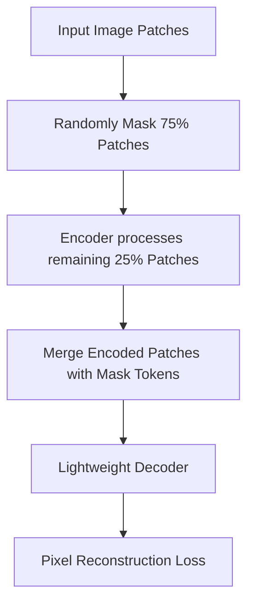

# Masked Autoencoding (MAE)

Masked Autoencoding (MAE) is a self-supervised pre-training paradigm introduced by Kaiming He et al. It masks out a high percentage (typically 75%) of the input image patches. The encoder only processes the remaining unmasked patches, creating a highly efficient representations pipeline. The lightweight decoder then attempts to reconstruct the original pixel values of the masked patches, forcing the transformer to learn semantic representations of object structures and geometries.

## Architectural Diagram

---
[← Back to README](../README.md)
