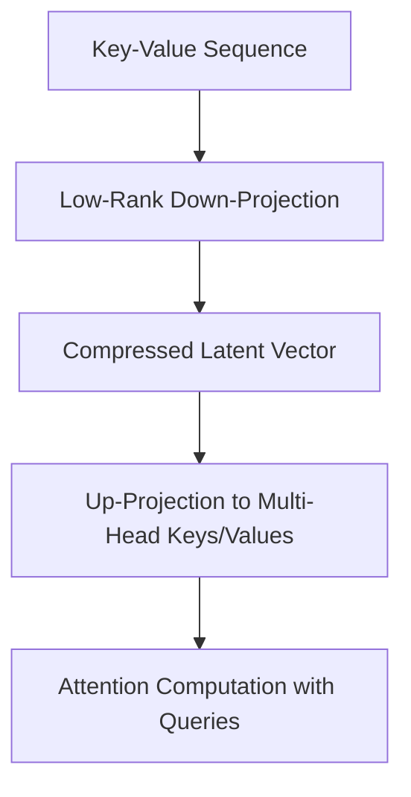

# Multi-Head Latent Attention (MLA)

Multi-Head Latent Attention (MLA), popularized by DeepSeek, addresses the memory bottlenecks of the Key-Value (KV) cache in transformer models. Instead of caching high-dimensional key and value vectors for every head, MLA down-projects keys and values into a shared low-rank latent vector before attention calculation. The latent space is up-projected on-the-fly during decoding, significantly reducing the VRAM footprint of long context sequences in multi-modal vision tasks.

## Architectural Diagram

---
[← Back to README](../README.md)
