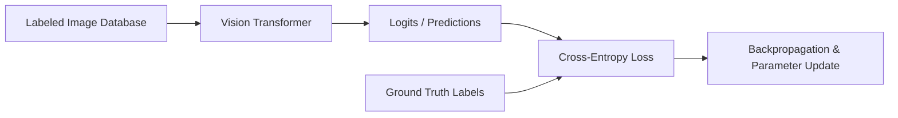

# Supervised ImageNet Scaling

Supervised ImageNet Scaling is the classical approach to training Vision Transformers. Since ViTs lack the localized spatial inductive biases of CNNs, they require millions of labeled examples to learn spatial hierarchies, edge detectors, and translation invariance. The model is trained end-to-end to classify images into categories, scaling up accuracy as model parameter size and dataset volume increase simultaneously.

## Architectural Diagram

---
[← Back to README](../README.md)
