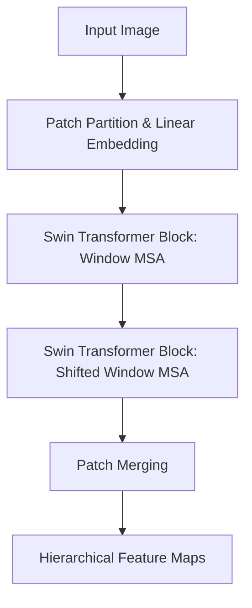

# The Hierarchical Sliding Window Era

The Hierarchical Sliding Window Era, spearheaded by the Swin Transformer, introduced shifted window-based self-attention. Instead of calculating global self-attention across all image patches, Swin divides the image into non-overlapping local windows. Attention is calculated only within these windows, bringing the complexity down to linear $O(N)$ with respect to image size. By shifting the window partition between consecutive layers, Swin allows cross-window communication, enabling hierarchical representations similar to CNN feature pyramids while retaining the global representation capability of Transformers.

## Architectural Diagram

---
[← Back to README](../README.md)
