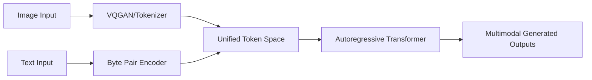

# The Unified Multi-Modal Token Era

The Unified Multi-Modal Token Era marks the unification of computer vision and natural language processing under a single sequence modeling framework. Instead of processing images through a standalone encoder and text through a separate decoder, modern systems serialize both text characters and visual frames into a unified discrete token workspace. Models like Meta's Chameleon or GPT-4o process multimodal tokens co-adaptively in a shared sequence context, enabling seamless mixed-mode generation, processing, and multi-turn conversational agents.

## Architectural Diagram

---
[← Back to README](../README.md)
