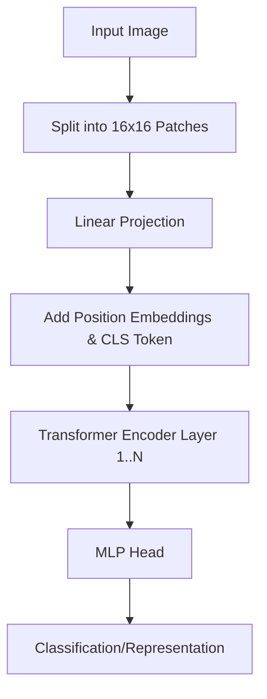

# The Vanilla Global Attention Era

The Vanilla Global Attention Era represents the foundational period of Vision Transformers, initiated by Dosovitskiy et al. in 2020. In this approach, 2D images are reshaped into a sequence of flattened 1D patches. These patches are then mapped to a vector dimension via a trainable linear projection layer. Learned positional embeddings are added to preserve spatial structure, and the sequence is fed into a standard Transformer encoder based on multi-head self-attention. The primary limitation of this era was the quadratic computational complexity ($O(N^2)$) of the global self-attention mechanism, which made it highly compute-intensive and restricted to lower-resolution images.

## Architectural Diagram

---
[← Back to README](../README.md)
