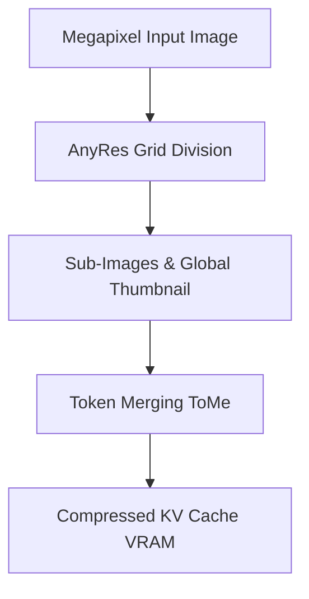

# Visual Token Explosion & KV Cache Satiation

The visual token explosion is a significant bottleneck when processing high-resolution images or videos. A single detailed document or framework layout can create thousands of patches, causing the Key-Value (KV) cache size in VRAM to explode quadratically. Mitigations like Dynamic Resolution Patching (AnyRes) chunk the image into smaller segments processed by local patches alongside a global downsampled thumbnail. Token Merging (ToMe) further reduces computation by dynamically merging redundant background tokens during forward passes.

## Architectural Diagram

---
[← Back to README](../README.md)
